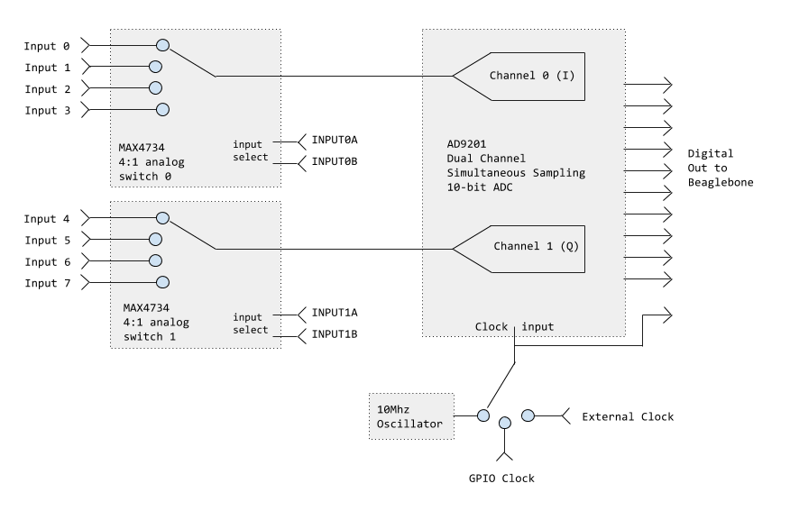

This doc describes the GPIO pins and corresponding PRU registers used to interface with the board.

**PRU fast GPIO**

BeagleBone has two 200MHz microcontrollers called PRUs to help with realtime tasks like continuously reading data from an external ADC into main memory.  For a general overview of this topic, check out this [BeagleBone PRU GPIO example](http://credentiality2.blogspot.com/2015/09/beaglebone-pru-gpio-example.html)

The main thing to know is that each PRU has GPIO pins that it can access really quickly through a pair of magic registers, r30 and r31.  Writing to r30 writes the GPIO pins, and reading from r31 reads them.  These tables show which pins on the [P8](http://exploringbeaglebone.com/wp-content/uploads/resources/BBBP8Header.png) and [P9](http://exploringbeaglebone.com/wp-content/uploads/resources/BBBP9Header.png) headers correspond to which bits in the PRU registers.

**Overview**

After the board boots, pull down the ADC_DISABLE line to wake up the ADC.

Generate a GPIO Clock signal with PRU0 and select it with jumper J1.  Or, we use J1 to select the onboard clock or an external clock.

Configure which of inputs 0..3 is connected to the ADC channel 0 (I), and which of inputs 4..7 is connected to channel 1 (Q) by setting pins INPUT0A, INPUT0B for channel 0 and pins INPUT1A, INPUT1B for channel 1.

Meanwhile, PRU1 watches for a clock transition on the ADC clock.  20ns after the rising edge it reads the ADC DATA pins to get the sample for channel 0.  20ns after the falling edge it reads the sample for channel 1.

**Pin assignments**

Here are the pins used by PRUDAQ:

ADC_DISABLE: Pin P9_25 (PRU0 r30 bit 7) must be pulled low to enable the ADC (otherwise the ADC's output pins confuse the beaglebone on bootup.)

GPIO Clock: Pin P9_31 (PRU0 r30 bit 0) provides a GPIO clock to the ADC.  (Jumper J1 selects between this clock source, the onboard 20MHz oscillator, and an external clock signal).

ADC Clock: Pin P8_30 (PRU1 r31 bit 11) sees the same clock signal the ADC does (whatever you've selected with J1).  Alternatively, you could set up the device tree overlay to use this pin as an output, configure P9_31 as an input, and then drive the ADC by writing to P8_30 via PRU1 r30 bit 11.

ADC DATA: Pins P8_27, P8_29, P8_39-46 (PRU1 r31 bits 0-9) are the 10 ADC data bits.  Per the AD9201 datasheet, they become valid about 20ns after the rising and falling edges of the clock for channels 0 (I) and 1 (Q).

INPUT0A, INPUT0B, INPUT1A, INPUT1B: Pins P9_27-30 (PRU0 r30 bits 5,3,1,2) control the two 4:1 analog switches.  The ADC has two inputs, and each one has a 4:1 analog switch in front, so we get a total of 8 input channels (see diagram above).

INPUT0A and INPUT0B control the first mux, and INPUT1A and INPUT1B control the second one.  INPUT0A and INPUT0B are also routed over to PRU1 so that it's easy to record which input is enabled along with the 10 data bits.  (This is somewhat complicated if we want to round-robin between inputs on every clock edge, since the ADC has a 3-cycle pipeline latency -- the data lines show you what was captured 3 cycles ago, while the select lines show you what's being captured now.).

If you use the board with the [BeagleLogic](https://github.com/abhishek-kakkar/BeagleLogic/wiki) software instead of the slower sample code we provide, PRU0 isn't available to control these pins or generate a GPIO clock. So in that case, instead we use the built-in PWM and GPIO features of the BeagleBone.  The table below shows that pin P9_29, which drives INPUT0A (the low order bit of the switch for inputs 0..3), can be controlled either through PRU0's r30 bit 1, or configured as gpio3[15] (aka gpio111) and controlled via the files in /sys/class/gpio/gpio111.

P9_29 = INPUT0A = PRU0 r30 bit 1 = gpio3[15] = /sys/class/gpio/gpio111/
P9_30 = INPUT0B = PRU0 r30 bit 2 = gpio3[16] = /sys/class/gpio/gpio112/
P9_28 = INPUT1A = PRU0 r30 bit 3 = gpio3[17] = /sys/class/gpio/gpio113/
P9_27 = INPUT1B = PRU0 r30 bit 5 = gpio3[19] = /sys/class/gpio/gpio115/

Input 0: INPUT0B=0  INPUT0A=0
Input 1: INPUT0B=0  INPUT0A=1
Input 2: INPUT0B=1  INPUT0A=0
Input 3: INPUT0B=1  INPUT0A=1

Input 4: INPUT1B=0  INPUT1A=0
Input 5: INPUT1B=0  INPUT1A=1
Input 6: INPUT1B=1  INPUT1A=0
Input 7: INPUT1B=1  INPUT1A=1

Pins P8_28 and P9_26 (PRU1 r31 bits 10 and 16) let PRU1 easily record INPUT0A and INPUT0B, as described just above.
