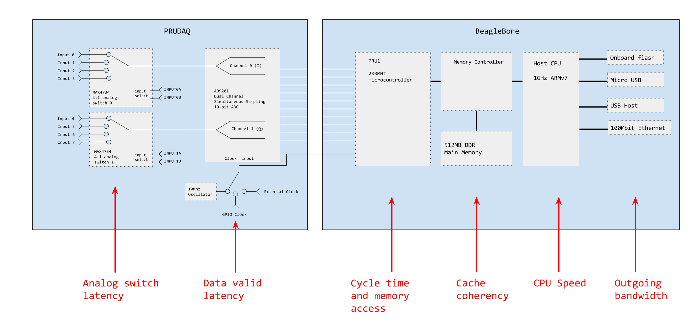

This doc considers timing and bandwidth issues in collecting, processing and storing data with prudaq.  If you're just concerned about how to store as much data as possible, skip down to the Performance section.



#Timing

The analog switches and ADC both have latencies that impact clock timing and readout.  This section talks about getting the analog signal into the ADC, the sample into the PRU, and the data into main memory.  If you only care about getting data into the host CPU, skip down to the Performance section.

##Analog switch latency

Latency and capacitance in the analog switches is something we can generally ignore, but becomes significant if we want to do round-robin sampling where we switch inputs between samples.

According to the datasheet, the MAX4734 analog switch takes up to 25ns to switch inputs.  So if we want to switch inputs between samples, we need to make sure we switch after the ADC has stored the previous sample, and at least 25ns before the next sample.  Aperture delay for the AD9201 is 4ns, so we need to wait at least that long after the rising clock edge.

Additionally, the MAX4734 has around 200pF of internal capacitance, and the input RC filter has 100pF.  So you'll need time for the input signal to overcome any stored charge, and this will depend on the source impedance driving the input.  If you're doing round-robin sampling, a useful trick is to attach a scope to the channel 0 and/or 1 SMA connectors, which will let you see the same thing the ADC input sees.  Pull one input to ground and another to 1-2VDC, and you can watch the switching and recovery time.

To accommodate both of these latencies, it's probably best to switch analog inputs as soon as possible (but at least 4ns) after the rising clock edge when the ADC samples its two channels.  See the "round_robin" example for how we can use PRU0 to generate a GPIO clock and switch inputs between cycles.

##Clocking into the PRU: data valid latency, PRU cycle time and memory access

The ADC samples both channels simultaneously on the rising clock edge.  There's a 3 cycle internal pipeline latency, and then the data is ready to appear on the data lines.  We tie the CLOCK line to the SELECT line, which lets us read out channel 0 on the rising clock edge (for the sample taken 3 cycles ago), and channel 1 on the falling edge.  The "Data Valid Delay" is 11ns and the "MUX Select Delay" is 7ns, and they happen in parallel.  So we need to wait at least 11ns after the rising or falling clock edge before we can safely read the data into the PRU from the data lines.

The 3 cycle pipeline latency adds complexity to the task of matching points in time with samples in memory.  The [InputOutput](InputOutput.md) page talks about how we sample the input select lines along with the data to make this more manageable.  But for cycle timing purposes we ignore the pipeline latency since it doesn't affect what we do within a single cycle.

The 11ns Data Valid Delay (and the MUX Select Delay, which happens in parallel and finishes first) means that after the PRU detects a rising or falling clock edge, it should wait 3 instruction cycles (200MHz -> 5ns per cycle) before reading the data lines.

Here we hit our first bandwidth bottleneck.  If we want to clock the AD9201 at its full 20MHz capacity for both channels, we have 50ns per cycle.  Since we read on both clock edges, that's 25ns, or 5 instructions, per sample.  The fundamental task for the PRU is "wait for clock edge (1 cycle), pause for data valid (3 cycles), load data (1 cycle)", which is already 5 cycles, but doesn't include looping or offloading the data to main memory.  Looping can be folded into the 3 cycle pause, but writing to main memory takes 1 constant cycle + 1 cycle per 32 bits written, plus a potential stall if the memory bus is in use.  So it's almost fast enough, but maybe not quite.  One edge case to consider is clocking the ADC with an external 20MHz clock, while the PRU is running slightly slower than 200MHz.  Then our 5 cycle routine takes slightly longer than 50ns, and once in a while we'll end up losing a sample.  (Fearless souls may be tempted to use a 2 cycle pause, assuming that the "wait for clock edge" and "load data" instructions will provide the minimum 11ns of data valid delay we need.)

[BeagleLogic](https://github.com/abhishek-kakkar/BeagleLogic/wiki) runs faster with prudaq than our sample code does by using PRU1 to read the data, and PRU0 to shift it from PRU registers into RAM.  And it can also generate the clock with PRU1 instead of waiting for it, avoiding the "slightly slow 200MHz" edge case, allowing capture at full data rate at the cost of not being able to use an external clock.  So it is possible to sample at the full rate, just not with the full range of clock and analog switch options we can do at lower rates.

#Performance

This section covers how the data gets from main memory to the CPU and from the CPU to nonvolatile storage or a network.

It's tempting to think that we're home free once the data makes it to main memory.  But here, sadly, is where we actually hit the largest bottlenecks.

##Cache Coherency

The BeagleBone host CPU is a 1GHz ARMv7 with two levels of cache between it and the 512MB of DDR memory.  We need to make sure that when we read in a sample, it's the fresh data we just read into RAM and not a cached version from earlier.  If you want to know the gory details, [this is a place to start](http://credentiality2.blogspot.com/2016/01/beaglebone-dma-notes.html).

There are two ways to safely fetch the samples from RAM.  The slower way which we'll call ```dma_alloc_coherent``` limits the host CPU to about 30MB/s of throughput, and this is what's supported by the prussdrv library that ships standard on BeagleBone.  Our sample code uses that, and consequently is limited to 5MHz sample rates when reading both channels, and 10MHz when reading only one.

The faster way is used by [BeagleLogic](https://github.com/abhishek-kakkar/BeagleLogic/wiki)'s excellent custom kernel driver, which also conveniently provides a /dev/beaglelogic block device you can read from.  That code supports over 100MB/s, and can also help you reach the full 20MHz rate supported by the ADC as described above.

So while our sample code is supported out of the box and simple to study, BeagleLogic's PRUDAQ support is what you probably want to use.

##CPU Speed

Once you have the data out of the shared memory and into cacheable RAM, you can go to town on it with the CPU.  At 40MSPS, the 1GHz CPU has 25 cycles per sample to play with.  But note that getting the data out of shared RAM ties up the CPU.  So if you're using our sample code to read 15MB/s (out of its maximum 30MB/s), the CPU is spending half its usable time busy-waiting in the kernel, and that's not time that you can use for other things.

##Outgoing Bandwidth

This, sadly, is our biggest bottleneck.  Apart from using the PRUs (which are tied up talking to PRUDAQ) or perhaps dodgy things using the HDMI port, we can't find any way to get data off of a BeagleBone faster than about 20MB/s.  PRUDAQ generates up to 40MSPS * 10 bits = 50MB/s packed, or 80MB/s for the 16 bit/sample format we use.  So unfortunately we don't know of any way to sample continuously at full speed without downsampling or compressing the data.

Here are some empirical results on how fast we can get data off of a BeagleBone Green or BeagleBone Black.  These results don't include PRUDAQ; we just pushed data through the interface as fast as we could using dd.  From fastest to slowest:

* USB Host with spinning disk.  The fastest results across all the tests were with a Seagate USB3 2TB portable (spinning) hard disk, at 20MB/s.  However, the BeagleBone doesn't have enough power to run this drive.  Even with a 5V supply plugged into the external power jack on the BeagleBone Black, we ended up with data corruption on the disk.  So use caution if you decide to try this approach.
* USB Host with flash drive.  We tried a bunch of different flash drives, all of which were rated much faster than we were able to get from the BeagleBone, and which gave us greatly varying results.  The winner was the tiny Samsung MUF-64BB/AM, at 14-18MB/s.  This is probably your best bet for max performance.
* Ethernet.  As befits its sterling reputation, the 100mbit Ethernet jack delivers its full rated bandwidth.  Using netcat we got 11.2MB/s to another host on the local network.
* microUSB.  This is the jack that you plug into your PC.  Using its network interface with netcat, we get 7.1MB/s to the host PC.
* Onboard flash.  Disappointingly, the hard-wired flash on the BeagleBone Black and BeagleBone Green is one of the slowest interfaces.  We managed 4.3MB/s with BeagleBone Black, and 9.4MB/s with BeagleBone Green.
