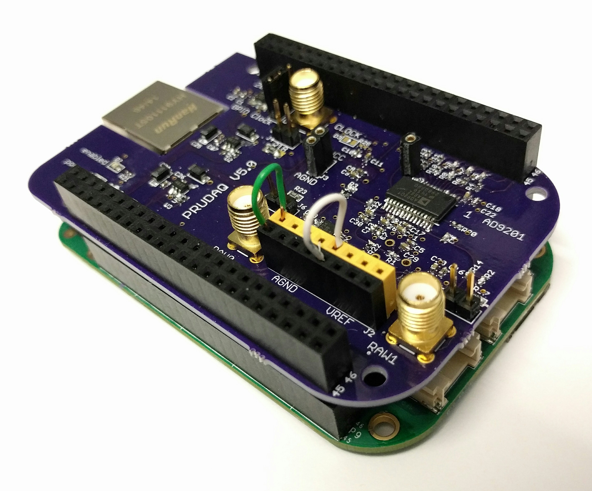

If you have a PRUDAQ board and are ready to start collecting samples, you've come to the right place.

Standard disclaimer: any time you're working with circuit boards, you really should use an anti-static mat and wrist strap.  We break this rule just like most other people do, but be warned that the AD9201 is quite sensitive and could easily be damaged by electrostatic discharge (even if you don't see or feel a spark).

## Set the jumpers

For this example we won't be using the SMA coax connectors on the board, so make sure that jumpers J4, J5 and J6 are not installed.  (They enable 50 ohm termination resistors which would load down the clock signal and inputs, which we don't want in this case).

J1 is a 3 pin header labeled **clock source** that lets you choose where the ADC clock signal comes from.  The ADC's two channels will be simultaneously sampled each time the clock goes high.  

The [Circuit Description](CircuitDescription.md) doc describes the clock options in detail, but let's keep it simple and choose the GPIO clock option by installing a jumper on J1 between the center pin and the pin near the center of the board labeled "GPIO Clock".

The GPIO clock is easy to configure in software for any sample rate we want.

## Attach a dummy input

We'll be reading from inputs 0 and 4.  Inputs left unconnected can show up with all sorts of values, so let's connect input 0 to the analog ground reference, and input 4 to the 1V "vref" voltage, which is sometimes used to make sure an input signal is centered at mid-scale.  Our 10-bit samples take on values between 0 and 1023, so we expect to see a value of about 512 from input 4.



On the black 8-pin header, the left 4 pins connect to analog ground.  Analog ground is electrically connected to the BeagleBone's ground, but with careful layout on the PRUDAQ board to minimize stray noise.  The green wire in the photo connects it to input 0.

The right 4 pins connect to vref.  vref really is just a reference; drawing any current from it will make it sag toward ground, and mess up the samples you collect.  So really we should buffer it (say, with a voltage-following op-amp) before connecting it to an input, especially if we were going to use it with the round-robin code in the examples/ directory.  But we just want to collect some samples with a value that isn't near zero, and connecting the 3.3V AVCC would exceed the 0-2V input range for the ADC.  The white wire in the photo connects it to input 4.

## Attach PRUDAQ to your BeagleBone Black or BeagleBone Green

Stack the PRUDAQ cape on top of the BeagleBone.  It can be tricky to get all 96 header pins on the cape lined up straight, so be patient.  Try to get the pins started all the way around, then work your way around the board a few times pushing the pins in a few millimeters at a time.

Take care that you don't push the cape in too far.  On our BeagleBone Black, for instance, there's a capacitor near the large USB jack that hits the bottom of the cape as the cape bottoms out, and you don't want the pins on the bottom of the RAW1 SMA jack to short to the USB jack's metal shell.

Attach the PRUDAQ cape before powering on the BeagleBone, then connect it to your computer with a USB cable. The Beaglebone should boot up as usual.  You'll know it booted successfully if you see the BeagleBone show up as a storage device on your PC, and if, a minute or so later, you can open the website served by your BeagleBone [http://192.168.7.2](http://192.168.7.2) with your browser.

## SSH into the BeagleBone

```
$ ssh debian@192.168.7.2
Debian GNU/Linux 7

BeagleBoard.org Debian Image 2015-07-13


default username:password is [debian:temppwd]

debian@192.168.7.2's password: (password is temppwd)
Last login: Mon Mar  9 21:52:01 2015 from 192.168.7.1
debian@beaglebone:~$ 
```

On older BeagleBone Black distros, you may instead have to login as root with a blank password.

Once you've verified that you can SSH into your beaglebone, it's time to decide between using BeagleLogic's PRUDAQ driver, or our sample code.  We recommend that you start with BeagleLogic, and only worry about our sample code if you want to write your own firmware and don't need sampling rates more than about 10MSPS.

## Option 1: Use the BeagleLogic system image

Follow the instructions for copying the [BeagleLogic System Image](https://github.com/abhishek-kakkar/BeagleLogic/wiki/BeagleLogic-%22no-setup-required%22-setup:-Introducing-System-Image!) to a microSD card.  Boot your BeagleBone from the card.  You'll know it worked if you can ```ls /opt/BeagleLogic```.

XXX TODO: Work out docs with Kumar from this point


### 2 - Option 2: Try our sample code

Most users should use BeagleLogic's PRUDAQ driver (option 1), but our sample code is esay to hack on and easy to build from a stock BeagleBone distro.

First we'll clone this repo onto your host PC, then copy it over to the home directory on the Beaglebone.  (You could also clone the repo directly from your BeagleBone if you've connected it to the internet via Ethernet or a USB wifi adapter).

If your host PC runs GNU/Linux, you can clone this repo with:

    $ git clone https://github.com/google/prudaq.git

That should create a subdirectory named ```prudaq```.  Now copy that whole directory to your BeagleBone:

    scp -r prudaq debian@192.168.7.2:~

*Note: The default password for the debian user is: temppwd*

Then ssh into the Beaglebone to build and install the code:

    user@host-pc$ ssh debian@192.168.7.2
    
    debian@beaglebone$ cd ~/prudaq/src
    debian@beaglebone$ make
    debian@beaglebone$ sudo make install  # This just copies the .dtbo file to /lib/firmware
    debian@beaglebone$ sudo ./setup.sh    # Init script that needs to be run once every time beaglebone is rebooted

Running ```make``` builds the ```prudaq_capture``` example program and assembles the firmware for the two realtime units.  ```prudaq_capture``` enables the ADC, loads the firmware into the PRUs, then reads binary sample data from the shared buffer and writes it to stdout.

```
$ sudo ./prudaq_capture 

Usage: prudaq_capture [flags] pru0_code.bin pru1_code.bin

  -f freq	 gpio based clock frequency (default: 1000)
  -i [0-3]	 channel 0 input select
  -q [4-7]	 channel 1 input select
  -o output	 output filename (default: stdout)
```

Let's turn up the clock to 2kHz and specify inputs 0 and 4 explicitly (even though they're the defaults), then pipe the binary data into hexdump so it's easy to read:

```
$ sudo ./prudaq_capture -i 0 -q 4 -f 2000 pru0.bin pru1.bin | hexdump -d -v | head
2097152B of shared DDR available.
 Physical (PRU-side) address:91800000
Virtual (linux-side) address: 0xb6b9a000

Actual GPIO clock speed is 2000.00Hz
0000000   00000   00000   00001   00513   00001   00513   00001   00513
0000010   00001   00513   00001   00513   00001   00513   00001   00513
0000020   00001   00513   00001   00513   00001   00513   00001   00513
0000030   00001   00513   00001   00513   00001   00513   00001   00513
0000040   00001   00513   00001   00513   00001   00513   00001   00514
0000050   00001   00513   00001   00513   00001   00513   00001   00513
0000060   00001   00513   00001   00513   00001   00513   00001   00513
0000070   00001   00513   00001   00513   00001   00513   00001   00513
0000080   00001   00513   00001   00513   00001   00513   00001   00513
0000090   00001   00513   00001   00513   00001   00513   00001   00513
	5256 bytes / second. 5256B written, 5256B read.
```

The numbers come from hexdump, while the other messages come from prudaq_capture (and technically were written to stderr instead of stdout).  The first column of numbers is the offset, followed by decimal readouts in 16-bit chunks, which happen to be exactly how far we pad out our 10-bit samples.  You can see that the first two values are 0 (due to the way the samples are read by the PRU, the first sample should be ignored).  Then we get alternating values of 1 and 513, which is just what we expected: channel 0 is connected to ground, while channel 1 is about midscale between 0 and 1023.


## Troubleshooting 

* If you only see the initialization output but no data after:

      2097152B of shared DDR available.
       Physical (PRU-side) address:9f5c0000
      Virtual (linux-side) address: 0xb6da4000
  
This is probably because the clock signal isn't being received, so no samples are being captured. Check to make sure a jumper is installed on J1 to select the GPIO clock or onboard clock.
